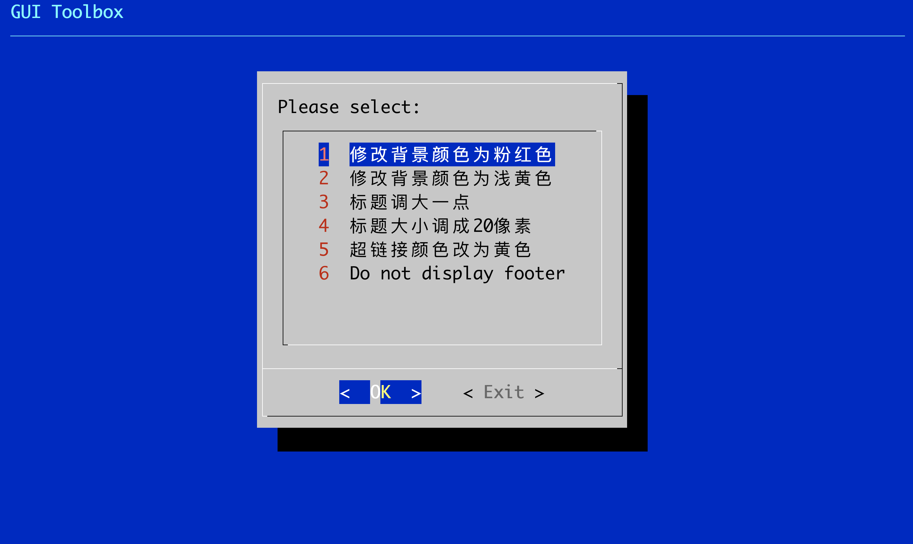

# PM Simulator

## Introduction

Use AI models to adjust the products just like how PM does without coding.

## Installation

```
git clone https://github.com/tobegit3hub/pm_simulator.git

cd ./pm_simulator/

pip3 install -r ./requirements.txt
```

## Usage

Use the pre-built website for demo.

### Start Server

Setup OpenAI API Key to access GPT models.

```
export OPENAI_API_KEY=sk-xxx
```

Start the server.

```
cd ./pm_simulator/server/

./server.py
```

Open the website in `http://127.0.0.1:5000`.

### CLI

Use the command to change the website style.

```
cd ./pm_simulator/client/

./client.py "Change the background to blue"
./client.py "背景换成红色"
```

Refresh the website in `http://127.0.0.1:5000` to find out the changes.

You can use the [auto refresh extension](https://chrome.google.com/webstore/detail/easy-auto-refresh/aabcgdmkeabbnleenpncegpcngjpnjkc) to reload automatically.

### GUI

Install the `dialog` first.

```
brew install dialog
```

Run the GUI toolkit to select the command to execute.

```
./gui_toolbox.py
```



### Voice

If you want to use voice client and "talk" to the server, you need to install the following libraries.

```
brew install portaudio

pip install pyaudio
```

Then run with the voice client and allow operating system to record your command.

```
./voice_client.py
```

If you have existing mp3 or wav files, you can use the voice files directly.

```
./voice_client.py ../../voices/change_background_to_light_yellow.wav
```

You can create the wav file easily with the scripts in `tools`.

```
./tools/voice_to_map3.py

./tools/mp3_to_wav.py output.mp3 make_title_larger.wav

./client/voice_client.py ./make_title_larger.wav
```
